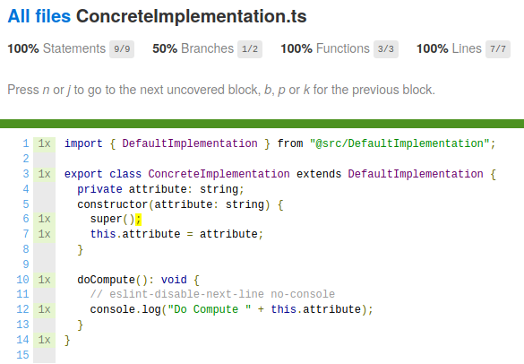

# README

## Requirements

- nodeJS (tested with 14.3.0 and 12.16.3)

## Procedure

```
git clone https://github.com/antoine-morvan/nyc-constructor-coverage-issue.git
(cd nyc-constructor-coverage-issue.git && \
  npm clean-install && \
  npm test)
```

Open `target/coveragejs/ConcreteImplementation.ts.html#L6` and observe that the constructor has an uncovered line (the
one calling `super()`):


